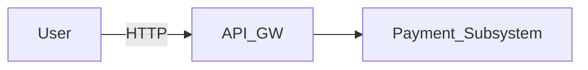
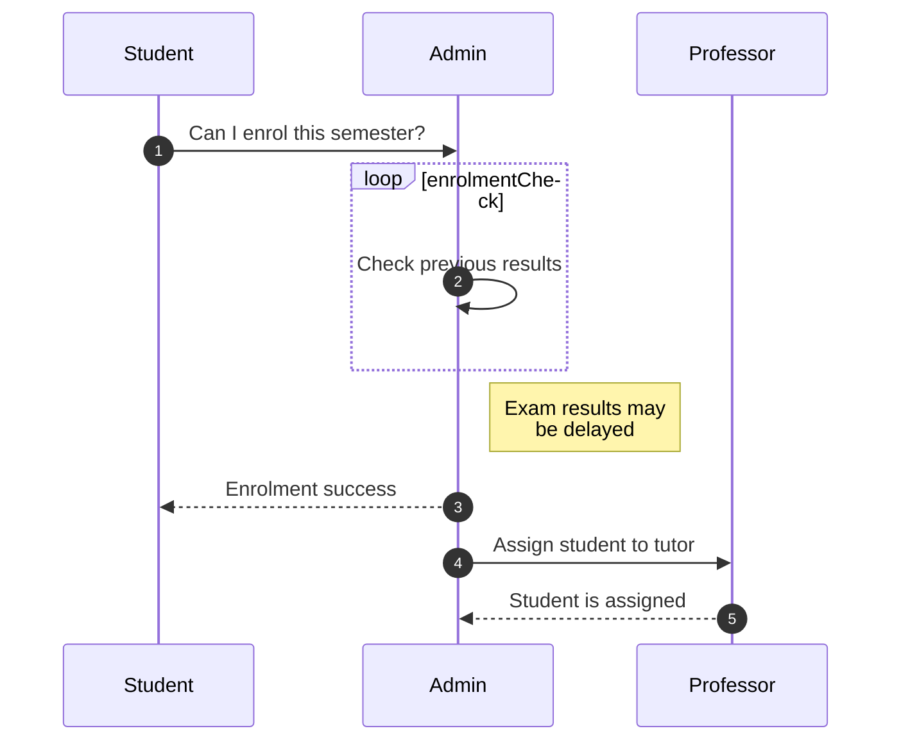
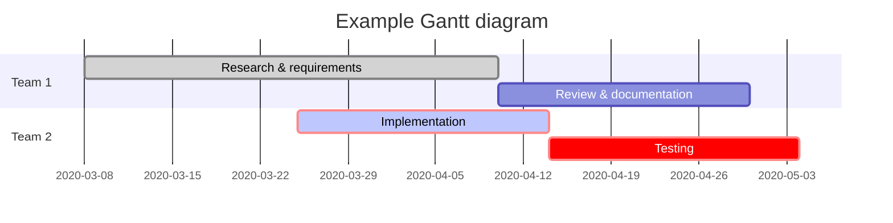
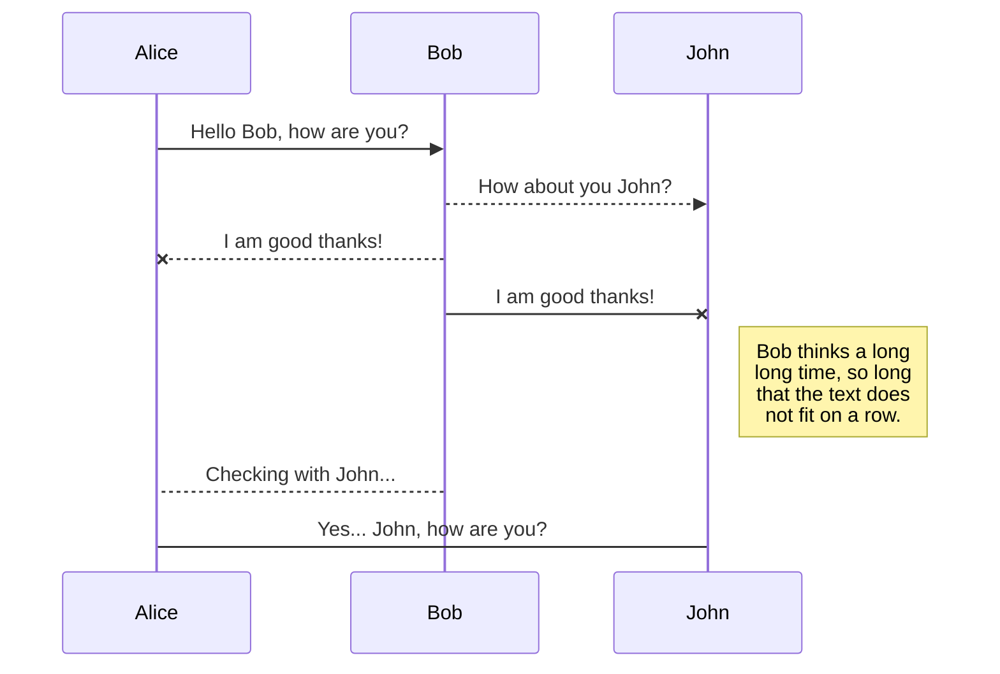

# Subsystem Design Document (SSD)
<!-- Replace {{…}} placeholders and delete helper text when ready -->

## 1. Overview & Context
### 1.1 Purpose
<!-- 1-2 paragraphs: why does the subsystem exist, what business value does it deliver -->

### 1.2 Scope & Boundaries
- **Parent system / Domain**: {{e-commerce platform}}
- **Bounded context** (DDD) : {{Payment}} ✔
- **Critical user journeys relying on this subsystem**: {{checkout, refund}}

> _Example_  
> “The **Payment Gateway Subsystem** authorises card & A2A payments for the e-commerce core, targeting p95 latency ≤ 300 ms at 2 000 rps peak.”  

---

## 2. Responsibilities & Boundaries
**Checklist**  
- Single clear responsibility (SRP):contentReference[oaicite:1]{index=1}  
- In/out of scope items enumerated  
- Upstream/downstream dependencies diagrammed (C4 Context):contentReference[oaicite:2]{index=2}  









---

## 3. Interface Contracts (ICD)

**Checklist**

* Transport + protocol (REST/gRPC/AMQP)([voa.va.gov][2])
* Message schema + examples
* Versioning policy (e.g., URI vN)
* **Idempotency strategy** (keys, retry, 24 h TTL)([stripe.com][3])
* SLA/SLO per endpoint (availability, p99 latency)([sre.google][4])

```http
POST /v2/payments
Idempotency-Key: 550e8400-e29b-41d4-a716-446655440000
```

---

## 4. Internal Architecture

### 4.1 Component Diagram (C4)

Embed PNG/SVG or PlantUML. Show main components, tech stack, data stores. C4 Component diagrams keep описания лаконичными и иерархичными.([c4model.com][5])

### 4.2 Data-Flow Diagram

Отразите источники данных, очереди, кэш, основной поток команд/событий. Используйте нотацию DFD/UML Activity для считываемости.([c4model.com][6])

---

## 5. Architectural Decisions (ADR Log)

| ID  | Title                                | Status   | Date       | Link            |
| --- | ------------------------------------ | -------- | ---------- | --------------- |
| 001 | Use PostgreSQL + Logical Replication | Accepted | 2025-06-01 | docs/adr/001.md |

> Регистрируйте **Context → Decision → Consequences**; каждое изменение → новый ADR.([medium.com][7])

---

## 6. Non-Functional Requirements (NFR)

| Attribute        | Target         | Rationale                  |
| ---------------- | -------------- | -------------------------- |
| **Availability** | 99.95 %/month  | Tier-1 checkout path       |
| **p99 latency**  | ≤ 300 ms       | Meet UX benchmark          |
| **Throughput**   | 2 000 rps peak | 2× 12-month traffic growth |

Опирайтесь на AWS Well-Architected (6 pillars) для полноты: Operability, Security, Reliability, Performance, Cost, Sustainability.([docs.aws.amazon.com][8])

---

## 7. Security & Threat Model

1. **System decomposition → STRIDE analysis**([cheatsheetseries.owasp.org][9])
2. Map counter-measures to **OWASP ASVS controls**.
3. List compliance obligations (PCI-DSS, GDPR).

```text
Threat: Tampering with payment amount
Mitigation: HMAC across payload + server-side verification
Residual risk: Low
```

---

## 8. Operations & Observability

### 8.1 CI/CD & Deployment

* Pipeline stages: test → security scan → deploy
* **Canary strategy**: 5 % traffic, auto-rollback on error rate > 2 %([cloud.google.com][10])

### 8.2 Telemetry

* **Metrics**: rps, error\_rate, latency\_p99
* **Logs**: structured, JSON, 30 days retention
* **Traces**: OpenTelemetry spans across API → DB

Три столпа наблюдаемости = metrics + logs + traces.([sematext.com][11])

---

## 9. Constraints & Risks

| Category     | Description            | Mitigation            |
| ------------ | ---------------------- | --------------------- |
| **Tech**     | Legacy Oracle upstream | Build CDC bridge      |
| **Business** | Launch by Q3           | Drop batch refund MVP |

Записывайте ограничения явно, чтобы будущие изменения не нарушили соглашения.([iso-architecture.org][12])

---

## 10. Roadmap & Evolution

* **v1** (2025-Q3) — card payments MVP
* **v1.1** (2025-Q4) — add SEPA Instant
* **Deprecation policy**: support N-1 API versions for 12 мес.

Следите за показателями ошибок → пересматривайте архитектуру, если SLO нарушается более 3 раз в квартал.([sre.google][4])

---

## Appendix

* **Glossary**
* **References** (link to ADRs, RFCs, external specs)

```
